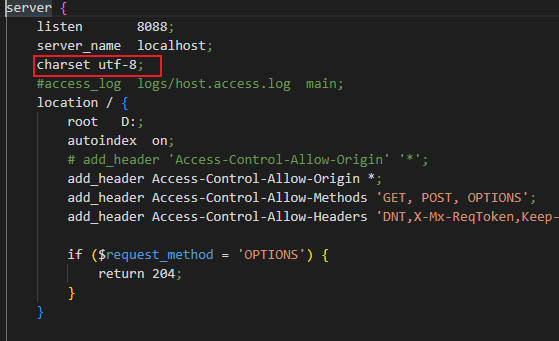
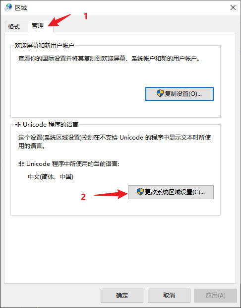
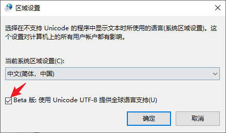

# 2. nginx处理中文路径

使用nginx发布静态资源，会遇上乱码，路径上中文都会变成一串莫名其妙的符号

要想处理这个问题

<figure><figcaption></figcaption></figure>

添加红框里的内容后，发现localhost:8088页面的文件识别没问题，但是点进其中的中文资源文件夹，就会出现路径乱码的情况，网上其他博客说是因为电脑的编码问题，需要把电脑的默认编码方式修改为utf-8，下面是步骤：

<figure><figcaption></figcaption></figure>

<figure><figcaption></figcaption></figure>

<figure><figcaption></figcaption></figure>

设置好后，系统提示重启电脑，重启即可
